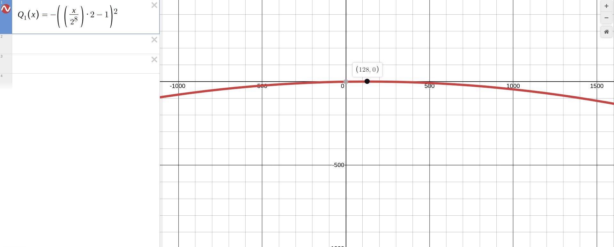
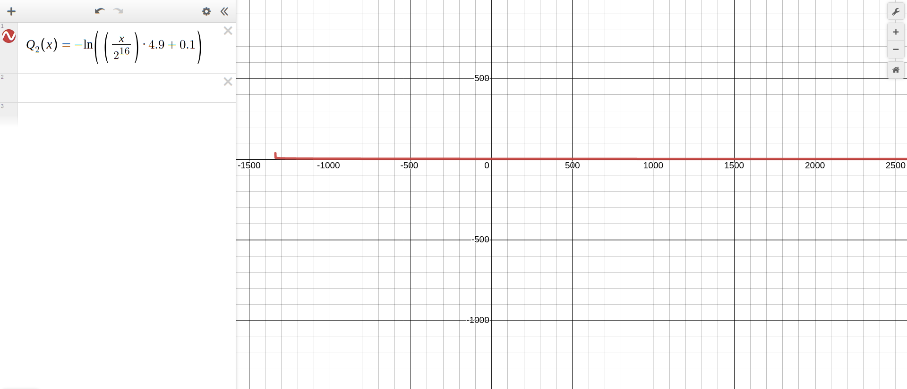

# Projet de LO21:

## Choix de conception :

Dans ce projet, la structure de données de la liste chainée a été implémentée de manière a ressembler à la liste du langage python car c'est un langage avec lequel nous avions de l'expérience avant de commencer ce projet. De plus, cela simplifie la compréhension et la manipulation de la liste.  

1.	Les listes chainées sont encapsulées dans une structure qui contient le départ, la fin et la longueur de la liste afin de simplifier le parcours et l’ajout en fin de liste.

2.	La communication entre les fonctions et le programme est donc effectuée par adresse, cela fait donc en sorte que la majorité de notre programme est écrit à l'aide de procédures.

3.	Les listes ne contiennent que des pointeurs sans types (void**) afin de permettre le stockage de plusieurs types de données différents sans avoir besoin de réécrire la structure pour les Bits et les individus.

4.  Les structures de données sont manipulées par le biais de leur adresse par habitude et également pour éviter de devoir retourner la structure modifiée. Cela permet de ne pas avoir à ce soucier des modifications apportées à la structure par les procédures et également de simplifier l'écriture et la lecture du code.

5. Le code du tri quick-sort a été inspiré en partie de [cette vidéo](https://www.youtube.com/watch?v=eqo2LxRADhU&t=1035s). Bien évidement il a été adapté afin de permettre le fonctionnement dans l'environement du langage C et avec les structures définies dans le projet.

6. Nous avons choisi d'intégrer un système d'enregisterement dans le programme afin de pouvoir accéder aux données pour chaque individu de chaque génération simplement. Le programme enregistre ces données dans un fichier texte nommé Population_Records.txt.

-------
## Algorithmes des sous-programmes :

L'algorithme consiste à croiser une population composée d'individus à valeurs aléatoires jusqu'à ce que ses individus aient une qualité optimale. Cette qualité est définie par les fonctions soit :  
$Q_1(X) = -X^2$
Où : $X = \frac{valeur}{2^{longIndiv}}\times{2}-1$ et $longIndiv = 8$  
Ou alors :  
$Q_2(Y) = -\ln{Y}$ où $Y = \frac{valeur}{2^{longIndiv}}\times{4.9}+0.1$ et $longIndiv = 16$  

Le type population et le type individu sont définis comme des listes d'individus et de Bits respectivement.

---

### Algorithme général

**Lexique** :
- nGen : **entier** entre 20 et 200
- TaillePop : **entier** entre 20 et 200
- tSelect : **entier** entre 10% et 90% du nombre d'individus
- pCroise : **réel** entre 0 et 1

**Résultat** : Population : Une population contenant des individus avec des valeurs proches de la qualité optimale.  

Population = créerPopulation(TaillePop)  
**pour** i de 0 à nGen **faire** :  
&emsp;Population = croiserPopulation(Population, pCroise)  
&emsp;Population = trierIndividus(Population, 1, taille(Population))  
&emsp;Population = choisirMeilleursIndividus(Population, tSelect)  
fin **pour**

**Données** : nGen, TaillePop, tSelect, pCroise  

---
### Créer une population
**Lexique** : 
- TaillePop : **entier** entre 20 et 200

**Résultat** : P : Une population initialisée avec TaillePop individus égalements initialisés.  
  
créerPopulation(TaillePop : **entier**) $\to$ P  
&emsp;P = créerListe()  
&emsp;longIndiv = 8  
&emsp;**pour** i de 1 à TaillePop **faire** :  
&emsp;&emsp;I = créerListe()  
&emsp;&emsp;I = CréerListeBit(individu, tailleIndiv)  
&emsp;&emsp;P = ajouterQ(P, I)  
&emsp;fin **pour**  
&emsp;créerPopulation(TaillePop) = P

---
### Créer une Liste de bit de manière itérative
**Lexique** : 
- L : **Liste** une liste de bit vide
- longIndiv : **entier** égal a 8 ou 16

**Résultat** : L : Une **liste** contenant des Bits représentant un individu.  
Ici entierAléatoire(a , b) est une fonction qui retourne un entier aléatoire entre a et b inclus.

CréerListeBit( L : **Liste**, longIndiv : **enter** ) $\to$ L  
&emsp;**pour** i de 0 jusqu'à longIndiv - 1 **alors**  
&emsp;&emsp;bit = entierAléatoire(0, 1)  
&emsp;&emsp;L = ajouterQ(L, bit)  
&emsp;fin **pour**  
&emsp;CréerListeBit(L, longIndiv) = L

---
### Créer une Liste de bit de manière récursive
**Lexique** : 
- L : **Liste** une liste de bit vide
- longIndiv : **entier** égal a 8 ou 16

**Résultat** : Une liste contenant des Bits représentant un individu.  
Ici entierAléatoire(a , b) est une fonction qui retourne un entier aléatoire entre a et b inclus.

CréerListeBitRecursive( L: **liste**, longIndiv : **entier** ) $\to$ **Liste**  
&emsp;**si** longIndiv $\neq$ 0 **alors**  
&emsp;&emsp;Bit = entierAléatoire(0, 1)  
&emsp;&emsp;L = ajouterQ(L, bit)  
&emsp;&emsp;CréerListeBitRecursive( L, longindiv ) = CréerListeBitRecursive(L, longIndiv - 1)  
&emsp;fin **si**  
&emsp;CréerListeBitRecursive( L, longindiv ) = L

---
### Croiser les individus d'une population
**Lexique** : 
- P : **Population**
- pCroise : **pCroise**
  
**Résultat** : P : Une population avec ses individus sélectionnés  
Ici entierAléatoire(a , b) est une fonction qui retourne un entier aléatoire entre a et b inclus.

croiserPopulation( P : **Population**, pCroise : **réel** ) $\to$ P  
&emsp;**pour** i de 0 à taille(Population)/2 **faire**  
&emsp;&emsp;a1 = entierAléatoire(1, taille(population))  
&emsp;&emsp;a2 = entierAléatoire(1, taille(population))  
&emsp;&emsp;Indiv1 = RécupérerElem(Population, a1)  
&emsp;&emsp;Indiv2 = RécupérerElem(Population, a2)  
&emsp;&emsp;tempIndiv = Indiv1  
&emsp;&emsp;Indiv1 = échangerBit(Indiv1 ,Indiv2, pCroise)  
&emsp;&emsp;Indiv2 = échangerBit(Indiv2 ,tempIndiv, pCroise)  
&emsp;&emsp;P = ajouter(P, a1, Indiv1)  
&emsp;&emsp;P = ajouter(P, a2, Indiv2)  
&emsp;fin **pour**  
&emsp;croiserPopulation(P, pCroise) = P  

---
### Choisir les meilleurs individus d'une population
**Lexique** : 
- Population : **Population** liste d'individu
- tSelect : **entier** nombre d'individu choisie

**Résultat** : P : Une population initialisée avec TaillePop individus égalements initialisés.  

choisirMeilleursIndividus(P : **Population**, tSelect : **entier**) $\to$ P 
&emsp;**pour** i de tSelect jusqu'à taille(P) **faire** :  
&emsp;&emsp;Indiv = RécupererElem(P, mod(i, tSelect))  
&emsp;&emsp;RécupererElem(P, mod(i, tSelect)) = RécupererElem(P, i)  
&emsp;&emsp;RécupererElem(P, i) = Indiv  
&emsp;fin **pour**  
&emsp;choisirMeilleursIndividus(P, tSelect) = P  

---
### Extention des observateurs pour une liste

**Lexique** : 
- L : **Liste**
- P : **entier** compris dans la taille de la liste
 
**Résultat** : ELT : L'élément a la position P dans la liste L.

RécupererElem( L : **Liste**, P : **entier** ) $\to$ **ELT**  
&emsp;i = 0  
&emsp;**tant que** i < P et pas vide(L) **faire** :  
&emsp;&emsp;L = queue(L)  
&emsp;&emsp;i = i + 1  
&emsp;fin **tant que**  
&emsp;RécupererElem(L, P) = tete(L)  

---
### Tri de la population

Le quick sort consiste a trier une liste en la divisant en deux partie à l'aide d'un pivot, puis en relançant la fonction sur chaque partie obtenue auparavant. On répète jusqu'a qu'il n'y ai plus qu'un seul élément de chaque côté puis en les comparant au pivot puis en les plaçants selon l'ordre souhaité.

**Lexique** : 
- P : **Population**
- Depart : **entier**
- Fin : **entier**

**Résultat** : P : une **Population** triée dans de manière décroissante grâce à l'algorithme du quick-sort.  

trierIndividus(P : **Population**, Début : **entier**, Fin : **entier**) $\to$ P  
&emsp;**si** Début < Fin :  
&emsp;&emsp;indice = partition(P, Début, Fin)  
&emsp;&emsp;P = trierIndividus(P, Début, indice - 1)  
&emsp;&emsp;P = trierIndividus(P, indice + 1, Fin)  
&emsp;fin **si**
&emsp;trierIndividus(P, Début, Fin) = P

---
### Partition
**Lexique** : 
- P : **Liste**
- Depart : **entier**
- Fin : **entier**

**Résultat** : indice : un **entier** qui représente l'emplacement du point de pivot dans la population P tout en triant la population P. 

partition(P: **Liste**, Départ: **entier**, Fin: **entier**) $\to$ indice  
&emsp;pivot = Qualité(RécupererElem(P, Départ))  
&emsp;pivotIndice = Départ  
&emsp;**pour** i de Départ à Fin **faire** :  
&emsp;&emsp;Indiv1 = RécupererElem(P, i)  
&emsp;&emsp;**si** Qualité(Indiv1) > pivot :  
&emsp;&emsp;&emsp;Indiv2 = RécupererElem(P, pivotIndice)  
&emsp;&emsp;&emsp;P = ajouter(P, i, Indiv2)  
&emsp;&emsp;&emsp;P = ajouter(P, pivotIndice, Indiv1)  
&emsp;&emsp;&emsp;pivotIndice = pivotIndice + 1  
&emsp;&emsp;fin **si**  
&emsp;fin **pour**   
&emsp;partition(P, Départ, Fin) = P  

---
### Récuperer la qualité d'un individu

**Lexique**
- I : **Individu**

**Résultat** : qualité : **entier** représentant la qualité d'un individu selon la fonction souhaitée parmi les fonctions décrites au départ

Qualité(I : **Individu**) $\to$ qualité  
&emsp;$longIndiv = taille(I)$  
&emsp;$X = \frac{valeur(I)}{2^{longIndiv}}\times{2}-1$  
&emsp;$Qualité(I) = -X^2$  

Ou alors : 

Qualité(I : **Individu**) $\to$ qualité  
&emsp;$longIndiv = taille(I)$  
&emsp;$Y = \frac{valeur(I)}{2^{longIndiv}}\times{4.9}+0.1$  
&emsp;$Qualité(I) = -\ln{Y}$  

---
### Recuperer la valeur d'un individu

**Lexique** :
- I : **Individu**

**Résultat** : valeur : **entier** la valeur en décimal représentée par la chaine de Bit en binaire représentant un individu 

valeur(I : **Individu**) $\to$ valeur  
&emsp;indice = 0  
&emsp;valeur = 0  
&emsp;**tant que** pas vide(I) **faire** :  
&emsp;&emsp;elem = tete(I)  
&emsp;&emsp;**si** elem $\neq$ 0 :  
&emsp;&emsp;&emsp;valeur = valeur + $2^{indice}$  
&emsp;&emsp;fin **si**  
&emsp;&emsp;indice = indice + 1  
&emsp;&emsp;I = queue(I)  
&emsp;fin **tant que**  
&emsp;valeur(I) = valeur

---
## Jeu d'essais : 

| fonction | longIndiv | pCroise | TaillePop | tSelect | nGen | Valeur Indiv |
| ----------- | ----------- | ----------- | ----------- | ----------- | ----------- |----------- |
| $Q_1$ | 8 | 0,5 | 20 | 4 | 20 | 120-130 |
| $Q_1$ | 8 | 0,5 | 20 | 18 | 20 | 120-130 |
| $Q_1$ | 8 | 0,5 | 200 | 4 | 20 | 126-128 |
| $Q_1$ | 8 | 0,5 | 20 | 4 | 200 | 120-130 |
| $Q_1$ | 8 | 0,5 | 200 | 150 | 200 | 127-129 |
| $Q_1$ | 8 | 0,5 | 200 | 10 | 20 | 128 |
| $Q_2$ | 16 | 0.5 | 20 | 2 | 20 | 0-7000 |
| $Q_2$ | 16 | 0,5 | 20 | 10 | 20 | 0-1500 |
| $Q_2$ | 16 | 0,5 | 200 | 100 | 20 | 0 |

---
## Commentaires sur les résultats :

### Résultats de la fonction Qualité 1 :

&emsp;On peut remarquer que le paramètre TaillePop qui régit le nombre d'individus dans une population influe sur la vitesse de convergence de la qualité des individus.  
&emsp;Le paramètre tSelect quand à lui influe sur l'hégémonie de l'individu avec la meilleure qualité sur le reste de la population. Par exemple dans le cas où tSelect = 18 et nGen = 20, la population reste hétérogène tout le long de l'évolution ou prends plus de temps pour atteindre l'état "parfait". Ainsi, pour résoudre ce problème, il faut donc augmenter le nombre de générations afin de permettre aux individus d'avoir la possibilté d'homogénéiser la population.  
&emsp;Le paramètre nGen en lui meme ne change quasiment rien car la population à déjà la possibilité de converger vers sa valeur maximale avant d'avoir atteint la 20e génération.  
&emsp;Lorsque l'on pousse l'algoritme au maximum avec les valeurs maximum permises (nGen = 200, TaillePop = 200 et tSelect = 150), on trouve que la valeur des individus de la population finale est très proche de 128

### Résultats de la fonction Qualité 2 :

&emsp;L'influence des paramètres est la globalement la même que la première fonction. Mais on peut tout de même remarquer que lorsque tSelect est faible, la divergence entre la valeur des individus et la valeur optimale est beaucoup plus importante que pour la première fonction.  

### Analyse mathématique :
&emsp;On peut voir que la valeur des individus tend vers 128 en utilisant la premiere fonction pour calculer la qualité.  Ceci est dû au fait que lorsque la longueur d'un individu est de 8 la fonction qualité devient : $Q_1(x) = -(\frac{x}{128}-1)^2$ ou x représente la valeur d'un individu. Si on graphe cette équation, on obtient la courbe représentée si-dessous courbe avec le maximum en $x = 128$ et $y = 0$. (Logiciel utilisé : Desmos en ligne)  
  
&emsp;Lorsque l'on utilise la seconde formule, on peut remarquer que la valeur d'un individu tends vers 0, cela est dû au fait que la deuxième équation de la qualité se maximise pour une qualité négative, or cela est impossible étant donné que la qualité est forcément positive. De plus, si on observe l'équation : $Q_2(x) = -\ln{(\frac{x}{2^{16}}*4.9+0.1)}$ on remarque qu'en zéro elle vaut $-\ln{(0.1)}$, de plus puisqu'elle est décroissante, comme le montre le graphe si dessous, on peut en déduire que la valeur maximale admise par cette fonction sur l'intervalle $\N^{+}$ est donc $-\ln{(0.1)}$.
(Logiciel utilisé : Desmos en ligne)

### Dans les deux cas

&emsp;Pour faire un parallèle avec l'intelligence artificielle, la Taille de la population représente la stabilité de la réponse, cela signifie que plus la taille est grande, plus la valeur finale sera proche de la valeur idéale. C'est dû au fait que la taille de la population représente la diversité génétique de la population et qu'avec une plus grande diversité le croisement entre individus est plus intéressant car les individus sont plus différents les uns des autres.  
&emsp;tSelect représente le taux de sélection des meilleurs individus, un tSelect très faible sélectionne dès la première génération les meilleurs mais laisse peu de temps à la population pour se reproduire. Le résultat est donc une population avec très peu d'évolution. À contrario, un tSelect grand laisse plus de temps aux individus pour se reproduire et donc laisse plus de chances pour atteindre leur valeur maximum mais prends plus de temps pour atteindre l'homogénéité.

&emsp;Nous avons trouvé en effectuant des tests une configuration relativement stable. Cette configuration à l'avantage de vite converger vers la reponse la plus optimale sans prendre trop de resources. Il est sûrement possible de trouver une configuration qui donnerait de meilleurs résultats tout en utilisant le moins de ressources possible. Pour cela on pourrait utiliser un autre programme qui utilise le fichier de sortie et qui utilise également un système générationnel afin de converger vers la configuration "ultime".